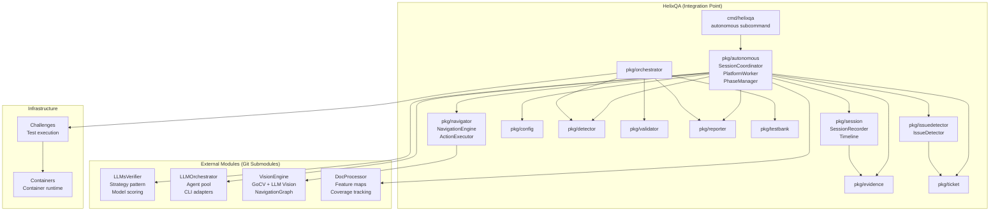
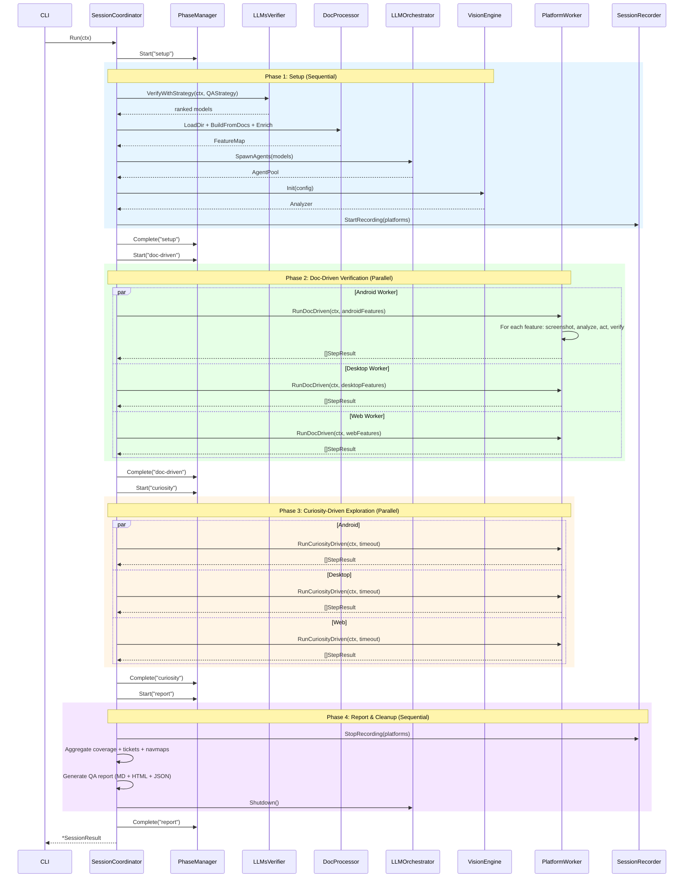
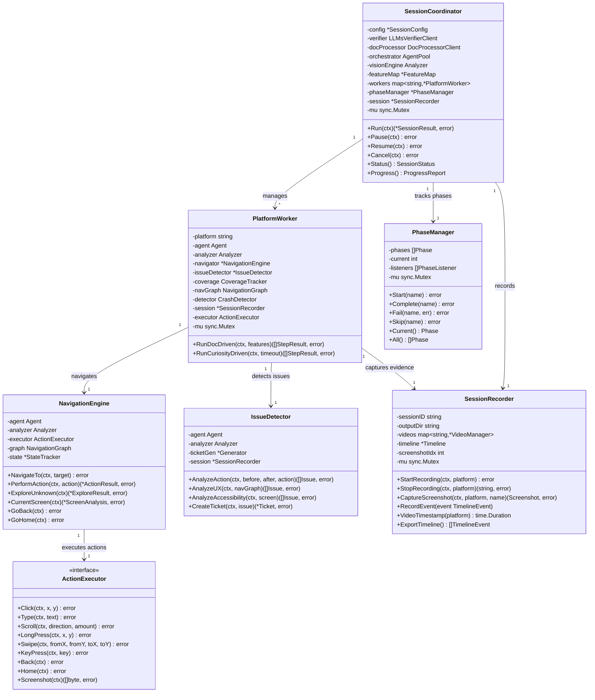
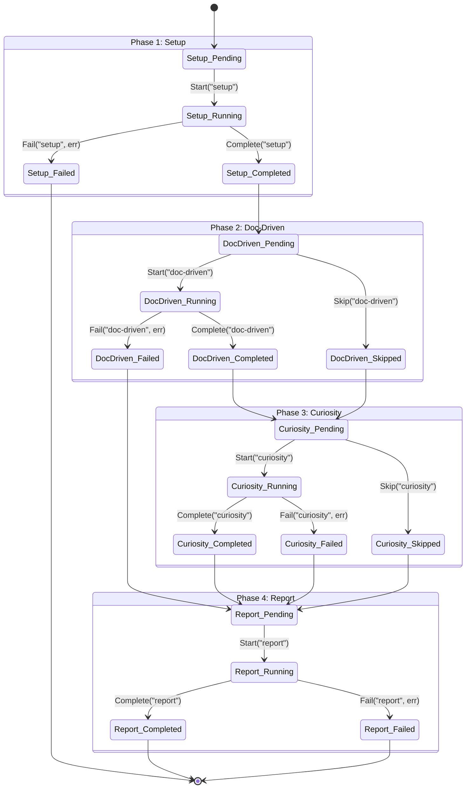
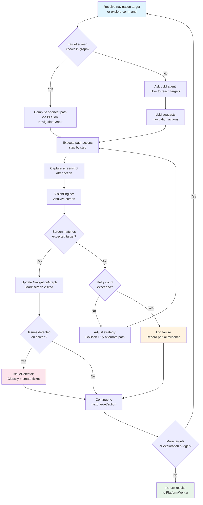

# HelixQA Architecture

## Overview

HelixQA is a QA orchestration engine built on Go 1.24+ that drives cross-platform testing with real-time crash/ANR detection, step validation, and evidence-based reporting. It composes existing vasic-digital modules (Challenges, Containers) rather than reimplementing their functionality.

## Module Dependency Graph

```
HelixQA (Orchestration Layer)
├── pkg/orchestrator  ── Main QA brain
├── pkg/testbank      ── YAML test bank management
├── pkg/detector      ── Real-time crash/ANR detection
├── pkg/validator     ── Step-by-step validation
├── pkg/evidence      ── Evidence collection (screenshots, logs, video)
├── pkg/ticket        ── Markdown ticket generation
├── pkg/reporter      ── QA report generation (MD, HTML, JSON)
├── pkg/config        ── Configuration types
└── cmd/helixqa       ── CLI entry point
    ↓ imports ↓
Challenges (Test Execution)
├── pkg/runner        ── Challenge execution engine
├── pkg/bank          ── Challenge bank loading (JSON)
├── pkg/challenge     ── Core types (Challenge, Definition, Result)
├── pkg/report        ── Report generation (MD, HTML, JSON)
├── pkg/logging       ── Structured logging
└── pkg/userflow      ── Multi-platform automation adapters
    ↓ imports ↓
Containers (Infrastructure)
├── pkg/compose       ── Container orchestration
├── pkg/runtime       ── Container runtime
└── pkg/lifecycle     ── Container lifecycle
```

## Data Flow

```
                    ┌──────────────────┐
                    │   CLI / Caller   │
                    └────────┬─────────┘
                             │ config + bank paths
                    ┌────────▼─────────┐
                    │   Orchestrator   │ ← Main brain
                    └────────┬─────────┘
                             │
              ┌──────────────┼──────────────┐
              │              │              │
     ┌────────▼────┐  ┌─────▼──────┐ ┌────▼──────┐
     │  TestBank   │  │  Detector  │ │ Validator  │
     │  Manager    │  │ (per plat) │ │ (per step) │
     └────────┬────┘  └─────┬──────┘ └────┬──────┘
              │              │              │
              │         ┌────▼──────┐      │
              │         │ Evidence  │◄─────┘
              │         │ Collector │
              │         └────┬──────┘
              │              │
     ┌────────▼──────────────▼──────┐
     │         Reporter             │
     │  (Markdown / HTML / JSON)    │
     └──────────────┬───────────────┘
                    │
              ┌─────▼──────┐
              │   Ticket   │
              │  Generator │
              └────────────┘
```

## Package Responsibilities

### pkg/orchestrator
The central coordinator. Loads test banks, iterates over platforms, runs challenges via the Challenges runner, invokes validation between steps, and produces the final report. Supports functional options for dependency injection.

### pkg/testbank
Manages QA-specific YAML test banks. Extends the Challenges JSON bank format with: platform targeting, priority levels (critical/high/medium/low), documentation references for consistency checking, and step definitions. Converts to `challenge.Definition` for execution.

### pkg/detector
Real-time crash and ANR detection per platform:
- **Android**: ADB logcat parsing, pidof process checks, screencap
- **Web**: Browser process monitoring, console error collection
- **Desktop**: Process alive checks, stderr monitoring

Uses the `CommandRunner` interface for testability.

### pkg/validator
Wraps the detector to perform pre/post-step validation. Takes screenshots before and after each step, runs crash detection, and produces `StepResult` with evidence. Prevents false positives by correlating detection with step state.

### pkg/evidence
Centralized evidence collection: screenshots (ADB screencap, Playwright, X11 import), logcat capture, video recording lifecycle, and console logs. All items are tracked with metadata (type, platform, timestamp, file size).

### pkg/ticket
Generates detailed Markdown issue tickets from failed steps or raw detections. Each ticket includes: severity, platform, reproduction steps, expected/actual behavior, stack traces, logs, and screenshot evidence. Designed to feed into AI fix pipelines.

### pkg/reporter
Produces QA reports in Markdown, HTML, or JSON. Reuses `digital.vasic.challenges/pkg/report` for individual challenge formatting. Adds QA-specific sections: platform breakdown, crash/ANR counts, step validation tables, and evidence references.

### pkg/config
Configuration types: platform selection, speed modes (slow/normal/fast), report formats, device targeting, and validation toggles. Supports YAML/JSON serialization.

## Design Decisions

1. **Composition over reimplementation**: HelixQA imports Challenges types directly. No wrapper types around `challenge.Definition`, `bank.Bank`, or `report.Reporter`.

2. **Functional options pattern**: All constructors use `WithX()` options for clean dependency injection and testing.

3. **CommandRunner interface**: Abstracts command execution (`adb`, `npx`, etc.) behind an interface, enabling full test coverage without real devices.

4. **Platform-agnostic orchestration**: The orchestrator runs the same pipeline for all platforms. Platform-specific behavior is encapsulated in detector and evidence packages.

5. **Evidence-first reporting**: Every failure includes evidence (screenshots, logs, traces). Tickets are self-contained for AI pipeline consumption.

## Test Coverage

| Package | Tests | Focus |
|---------|-------|-------|
| config | Unit + edge | Validation, parsing, defaults |
| detector | Unit + platform | Android/Web/Desktop detection |
| validator | Unit + concurrent | Step validation, evidence |
| reporter | Unit + format | Markdown, HTML, JSON output |
| orchestrator | Unit + edge + integration + stress | Full pipeline, cancellation |
| testbank | Unit + stress + benchmark | YAML loading, filtering |
| ticket | Unit + stress + benchmark | Markdown generation |
| evidence | Unit + stress + benchmark | Concurrent capture |

Total: **235 tests**, all passing with `-race` flag.

## CLI

```
helixqa run        --banks <paths> [--platform all] [--speed fast]
helixqa list       --banks <paths> [--platform android] [--json]
helixqa report     --input <dir>   [--format html]
helixqa autonomous --project <path> --platforms <list> --env <file> [--timeout 2h]
helixqa version
```

---

## Autonomous QA Session Architecture

The Autonomous QA Session extends HelixQA with LLM-powered autonomous testing. A `SessionCoordinator` manages 4 sequential phases, delegating platform testing to parallel `PlatformWorker` instances. Each worker gets its own LLM agent, vision analyzer, navigation engine, and crash detector.

### Component Diagram



### Sequence Diagram: 4-Phase Session Lifecycle



### Class Diagram: Key Types



### State Diagram: PhaseManager



### Flowchart: Navigation Engine Decision Flow



### Vision Provider Architecture

HelixQA uses a dual-model architecture for autonomous QA sessions:

```
                    ┌─────────────────────────────┐
                    │     LLMsVerifier             │
                    │  (Dynamic Model Selection)   │
                    └──────────┬──────────────────┘
                               │ probe + score + rank
                    ┌──────────▼──────────────────┐
                    │     Available Providers       │
                    ├──────────────────────────────┤
                    │  Vision Models:               │
                    │  ├── Astica.AI (specialized)  │
                    │  ├── Gemini 2.0 Flash         │
                    │  ├── OpenAI GPT-4o            │
                    │  ├── Ollama (local, free)     │
                    │  └── llama.cpp RPC (distrib.) │
                    │                               │
                    │  Chat Models:                 │
                    │  ├── Any text-capable cloud   │
                    │  └── Local Ollama text models  │
                    └──────────┬──────────────────┘
                               │ best model per phase
              ┌────────────────┼────────────────┐
              │                │                │
     ┌────────▼────┐  ┌───────▼───────┐ ┌──────▼──────┐
     │  Learn/Plan  │  │Execute/Curiosity│ │  Analyze    │
     │  (Chat)      │  │   (Vision)      │ │  (Chat)     │
     └─────────────┘  └────────────────┘ └─────────────┘
```

**Key design decisions:**
- No hardcoded model preferences. All selection is score-based via LLMsVerifier.
- Astica.AI is a specialized vision API that competes on score alongside general-purpose providers.
- Local Ollama models get cost=1.0 (free) and compete on quality/speed/reliability.
- Distributed llama.cpp RPC splits large models across thinker.local (GPU) + amber.local (CPU).
- FallbackProvider in VisionEngine chains multiple providers for resilience.

### Bridge Adapter Pattern

HelixQA acts as the sole integration point. External modules (LLMsVerifier, LLMOrchestrator, VisionEngine, DocProcessor) define their own interfaces with no cross-dependencies. HelixQA bridges them via adapter implementations:

```
LLMOrchestrator.Agent ──► agentLLMAdapter ──► DocProcessor.LLMAgent
LLMOrchestrator.Agent ──► visionAgentAdapter ──► VisionEngine.VisionProvider
VisionEngine.NavigationGraph ◄── NavigationEngine holds reference
LLMsVerifier.StrategyScore ──► ModelInfo ──► LLMOrchestrator
```

### Resilience Architecture

The system implements 5 degradation levels:

1. **Full capability** -- All LLM + Vision working: full autonomous session
2. **Degraded vision** -- LLM Vision fails: GoCV-only mechanical analysis
3. **Degraded navigation** -- Agent failures: collect partial evidence, generate partial report
4. **Session abort** -- Unrecoverable errors: clean shutdown with error report
5. **Per-agent circuit breaker** -- 3 consecutive failures mark agent unhealthy, replacement acquired from pool

Every LLM call uses: exponential backoff (1s/2s/4s), malformed JSON fallback with re-prompt, and prompt injection sanitization.
