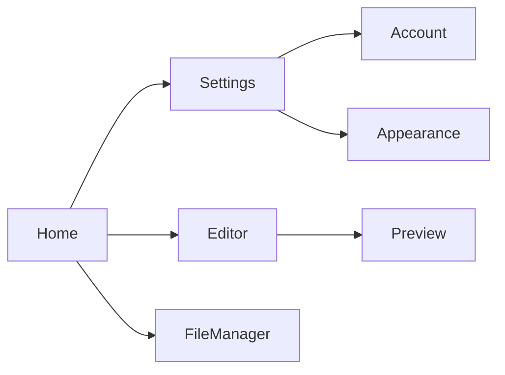

# Video Course: HelixQA Autonomous QA Session

8-episode video course covering the architecture, setup, usage, and extension of the Autonomous QA Session feature in HelixQA.

---

## Episode 1: Architecture Overview -- The 4-Phase Session

**Duration:** 12 minutes
**Level:** Intermediate
**Prerequisites:** Familiarity with HelixQA basics (run, list, report subcommands)

### Script

**[0:00 - 1:30] Introduction**

Welcome to the HelixQA Autonomous QA Session video course. In this first episode, we cover the high-level architecture -- how the system uses LLMs and computer vision to autonomously test your application across Android, Desktop, and Web.

The autonomous session answers a question every QA team faces: "Can we test our app without writing test scripts for every feature?" The answer is yes -- by combining your project documentation with LLM agents that can see and interact with your app.

**[1:30 - 4:00] The 4-Phase Model**

The session runs in 4 sequential phases:

Phase 1: Setup. This is where the system reads your project documentation, selects the best available LLMs, spawns CLI agents, and initializes the vision engine. Think of it as the QA team arriving at the office and reading the test plan.

Phase 2: Doc-Driven Verification. For each documented feature, a platform worker navigates to the relevant screen, performs the expected actions, and verifies the outcome. This is the equivalent of a QA engineer working through a test matrix.

Phase 3: Curiosity-Driven Exploration. Workers explore parts of the app not covered by documentation. They try edge cases, empty inputs, rapid clicks, and unusual navigation paths. This is the equivalent of exploratory testing.

Phase 4: Report and Cleanup. The system stops recording, aggregates all findings, links evidence to video timestamps, and generates the QA report.

Show the Phase 1-4 diagram from ARCHITECTURE.md. Walk through each phase box, highlighting that Phases 2 and 3 run in parallel across platforms.

**[4:00 - 7:00] Module Architecture**

The autonomous session integrates 4 external Go modules:

LLMsVerifier selects which LLMs to use. It scores models on responsiveness, vision capability, instruction following, and reliability. A pluggable Strategy pattern lets you define custom scoring criteria.

DocProcessor reads your project documentation -- Markdown, YAML, HTML, AsciiDoc, RST -- and builds a structured feature map. Each feature gets test steps, expected screens, and priority classification.

LLMOrchestrator manages headless CLI agents. It supports 5 agents: OpenCode, Claude Code, Gemini, Junie, and Qwen Code. Each agent runs as a subprocess with stdin/stdout pipe communication and file-based artifact exchange.

VisionEngine combines GoCV mechanical vision (fast, deterministic, free) with LLM Vision APIs (intelligent, semantic). GoCV handles screenshot diffing, edge detection, and contour analysis. LLM Vision handles screen identification, UI comprehension, and issue detection.

Show the component diagram. Emphasize that no module imports another directly -- HelixQA bridges them via adapter implementations.

**[7:00 - 9:30] Key Types**

Walk through the core types:

SessionCoordinator -- the brain. It holds references to all modules, manages platform workers, and drives phase transitions.

PlatformWorker -- one per platform. Each worker gets a dedicated LLM agent, vision analyzer, navigation engine, and crash detector. Workers run in parallel during Phases 2 and 3.

PhaseManager -- tracks phase state transitions (pending, running, completed, failed, skipped) and notifies listeners.

NavigationEngine -- maintains a directed graph of app screens and uses BFS pathfinding to navigate between them.

IssueDetector -- classifies bugs across 6 categories: visual, UX, accessibility, functional, performance, and crashes.

SessionRecorder -- manages video recording, screenshots, and the event timeline.

**[9:30 - 11:00] Data Flow**

Walk through a single verification step:

1. Worker receives feature "Markdown editing" with 3 test steps
2. Step 1: "Open new document" -- worker asks agent, agent says "Click File menu, then New"
3. Worker takes pre-screenshot, executes click via ActionExecutor, takes post-screenshot
4. VisionEngine compares before/after, confirms new screen appeared
5. CoverageTracker marks step as verified
6. SessionRecorder logs timeline event with video timestamp
7. NavigationGraph adds edge from "Home" to "New Document"

**[11:00 - 12:00] Summary**

Recap the 4 phases, 4 external modules, and 4 new HelixQA packages. In the next episode, we set up the .env configuration file and install all prerequisites.

---

## Episode 2: Setting Up .env Configuration

**Duration:** 10 minutes
**Level:** Beginner
**Prerequisites:** Episode 1

### Script

**[0:00 - 1:00] Introduction**

The entire autonomous session is configured via a single .env file. In this episode, we walk through every configuration group, explain what each setting does, and set up a minimal working configuration.

**[1:00 - 2:30] Copy the Template**

Start by copying the template:

```bash
cd /path/to/HelixQA
cp .env.example .env
```

Open .env in your editor. The file is organized into 8 sections: Master Switch, LLMsVerifier, API Keys, CLI Agents, Vision Engine, Doc Processor, Recording, and Platform-specific settings.

**[2:30 - 4:00] API Keys**

The first thing to configure is at least one API key. For the best experience, use a vision-capable provider. Show the API key section and demonstrate setting the Anthropic key.

Explain that the system uses LLMsVerifier to score all configured models and automatically selects the best one. You do not need to manually choose a model.

**[4:00 - 5:30] CLI Agents**

Show the agents section. Explain that agents are headless CLI tools that the system spawns as subprocesses. Demonstrate checking that an agent binary is installed:

```bash
which claude
```

Set the path and pool size. Explain that pool size determines how many platforms can run in parallel. If pool size is less than the number of platforms, they queue.

**[5:30 - 7:00] Platform Configuration**

Walk through each platform section:

Android: device ID (from `adb devices`), package name.
Desktop: process name, display ID.
Web: URL, browser choice.

Demonstrate setting up a desktop-only configuration as the simplest starting point.

**[7:00 - 8:30] Session Parameters**

Explain the master switch settings:

HELIX_AUTONOMOUS_TIMEOUT -- how long the entire session can run.
HELIX_AUTONOMOUS_COVERAGE_TARGET -- the system aims for this feature coverage percentage.
HELIX_AUTONOMOUS_CURIOSITY_ENABLED -- toggle exploratory testing.
HELIX_AUTONOMOUS_CURIOSITY_TIMEOUT -- time budget for exploration.

**[8:30 - 9:30] Recording and Output**

Show the recording settings. Explain that video recording requires ffmpeg. Screenshots are always captured regardless of video settings.

Show the output settings -- directory, report formats, ticket generation.

**[9:30 - 10:00] Summary**

Recap: copy .env.example, set one API key, configure one agent, configure one platform. That is the minimum viable setup. In the next episode, we run our first session.

---

## Episode 3: Running Your First Session

**Duration:** 15 minutes
**Level:** Beginner
**Prerequisites:** Episode 2 (configured .env)

### Script

**[0:00 - 1:00] Introduction**

With our .env configured, it is time to launch an autonomous session. We will use a desktop-only setup for simplicity, but everything applies equally to Android and Web.

**[1:00 - 3:00] Start the App Under Test**

Before launching the session, start your application:

```bash
./gradlew :desktopApp:run &
```

Wait for the window to appear. Explain that the autonomous session needs a running app to interact with. It does not start the app itself.

**[3:00 - 5:00] Launch the Session**

```bash
helixqa autonomous \
  --project /path/to/Yole \
  --platforms desktop \
  --env .env \
  --timeout 30m \
  --output qa-results/
```

Walk through each flag as it is typed.

**[5:00 - 8:00] Watch Phase 1: Setup**

Show the console output as the system starts up. Explain each log line:

- LLMsVerifier scoring models
- DocProcessor extracting features from documentation
- Agent spawning
- Vision engine initialization
- Video recording starting

Point out the feature count -- this tells you how many features the doc-driven phase will verify.

**[8:00 - 11:00] Watch Phase 2: Doc-Driven Verification**

Show the console as the worker verifies features. Watch the app window -- you can see clicks happening, text being typed, navigation occurring. All of this is autonomous.

Explain that each "verified" line means the system successfully navigated to a feature, performed the expected actions, and confirmed the outcome via screenshot comparison and LLM analysis.

Show a failure -- perhaps a feature that changed since the docs were written. Explain that a ticket is generated with full evidence.

**[11:00 - 13:00] Watch Phase 3: Curiosity Exploration**

Show the worker exploring unknown areas. Point out that it is clicking on UI elements that were not mentioned in any documentation. This is where undocumented bugs and edge cases get discovered.

**[13:00 - 14:30] Phase 4: Report**

Show the final output:

```
[report] Coverage: 38/42 features verified (90.5%)
[report] Tickets: 3 issues found
[report] Reports written to: qa-results/
```

Browse the output directory. Show the report, tickets, screenshots, and video.

**[14:30 - 15:00] Summary**

First session complete. We verified 90% of documented features, found 3 issues, and have full video evidence. In the next episode, we dive deep into platform workers.

---

## Episode 4: Platform Workers Deep Dive

**Duration:** 14 minutes
**Level:** Intermediate
**Prerequisites:** Episode 3

### Script

**[0:00 - 1:30] Introduction**

Platform workers are the hands of the autonomous session. Each worker runs on a single platform (Android, Desktop, or Web) with its own dedicated LLM agent, vision analyzer, and action executor. In this episode, we examine how workers operate and how they differ per platform.

**[1:30 - 4:00] Worker Architecture**

Show the PlatformWorker struct from the class diagram. Walk through each field:

- agent: the LLM that makes decisions (acquired from the agent pool)
- analyzer: the VisionEngine instance for screen analysis
- navigator: the NavigationEngine that maintains the screen graph
- issueDetector: classifies bugs found during testing
- coverage: tracks which features have been verified
- executor: platform-specific action execution (ADB, Playwright, or X11)

Explain the worker lifecycle: constructed during Phase 1, runs doc-driven in Phase 2, runs curiosity in Phase 3, results collected in Phase 4.

**[4:00 - 7:00] ActionExecutor Implementations**

Walk through each executor:

ADBExecutor: Uses `adb shell input tap`, `adb shell input text`, `adb shell input swipe`, and `adb exec-out screencap -p` for screenshots. Show example ADB commands being executed.

PlaywrightExecutor: Uses the Playwright Node.js API via subprocess. Click, fill, press, and screenshot are mapped to Playwright page methods. The browser runs headlessly.

X11Executor: Uses `xdotool` for mouse and keyboard events, `import` from ImageMagick for screenshots. Works on any X11 desktop. Show example xdotool commands.

**[7:00 - 9:30] Doc-Driven Verification Loop**

Walk through the RunDocDriven method step by step:

1. Sort features by priority (critical first)
2. For each feature, iterate through test steps
3. Per step: capture pre-screenshot, send context to LLM, parse action, execute via ActionExecutor, capture post-screenshot, diff with VisionEngine, evaluate, update coverage
4. If a step fails, IssueDetector analyzes the failure and creates a ticket
5. NavigationGraph is updated with every screen transition

Show how the LLM receives the feature description, current screenshot, and available UI elements, then returns structured actions.

**[9:30 - 12:00] Curiosity-Driven Exploration Loop**

Walk through the RunCuriosityDriven method:

1. Query NavigationGraph for unvisited screens
2. For each unvisited screen, compute a path and navigate there
3. On each screen, ask the LLM: "What can you try here that might reveal bugs?"
4. Execute suggested actions (empty inputs, rapid clicks, boundary values)
5. Analyze results, create tickets for any issues
6. Continue until timeout or all reachable screens visited

Show the exploration budget concept -- the curiosity timeout controls how long this phase runs.

**[12:00 - 13:30] Agent Pool Management**

Explain how workers acquire agents from the pool:

- If pool size >= platform count: one agent per platform, true parallelism
- If pool size < platform count: platforms queue via Acquire() with context timeout
- Each agent has a circuit breaker: 3 consecutive crashes marks it unhealthy
- Unhealthy agents are replaced if alternatives are available

**[13:30 - 14:00] Summary**

Workers are the core execution units. Each combines an LLM brain with platform-specific hands. The next episode covers the navigation engine in detail.

---

## Episode 5: Navigation Engine

**Duration:** 13 minutes
**Level:** Intermediate
**Prerequisites:** Episode 4

### Script

**[0:00 - 1:30] Introduction**

The NavigationEngine is how the autonomous session moves through your app. It maintains a directed graph of screens (nodes) and actions (edges), uses BFS pathfinding to reach target screens, and delegates to the LLM for unknown navigation paths. This episode covers how it works.

**[1:30 - 4:00] The Navigation Graph**

Show the NavigationGraph interface from VisionEngine. Explain that:

- Nodes are unique screens, identified by visual similarity hashing
- Edges are actions (click, swipe, back) that transition between screens
- The graph grows incrementally as the session explores more of the app
- Coverage() returns the percentage of discovered screens that have been visited

Walk through graph operations: AddScreen, AddTransition, PathTo (BFS), UnvisitedScreens.

Show the graph export formats: DOT (Graphviz), JSON, Mermaid. Demonstrate rendering a Mermaid graph in the QA report.

**[4:00 - 7:00] Screen Identification**

Explain the two-layer analysis from VisionEngine:

Layer 1 (GoCV): Screenshot diffing via SSIM, edge detection for UI element bounding boxes, contour detection for all elements. This is fast, deterministic, and free.

Layer 2 (LLM Vision): Screen identification ("This is the Settings page"), element labeling ("The blue button says Save"), navigation suggestions ("Click the hamburger menu to open the sidebar").

GoCV runs first, producing structured data (14 detected elements at these coordinates). This context is fed to the LLM Vision, dramatically reducing hallucination.

**[7:00 - 9:30] Decision Flow**

Walk through the flowchart from ARCHITECTURE.md:

1. Receive target (e.g., "navigate to Settings")
2. Check if target screen exists in the graph
3. If yes: compute shortest BFS path and execute actions step by step
4. If no: ask the LLM agent "How do I reach the Settings screen from here?"
5. After each action: capture screenshot, analyze with VisionEngine, check if target reached
6. If target not reached after max retries: log failure, try alternate path
7. If target reached: update graph with new transition, check for issues

Explain the retry and fallback logic. The engine never gets stuck -- it tries alternate paths, goes back, and eventually accepts partial progress.

**[9:30 - 11:30] State Tracking**

Show the StateTracker struct:

- CurrentScreenID: where the worker is right now
- History: ordered list of all visited screens (used for back navigation)
- BackStack: explicit back path for GoBack()
- FailedPaths: paths that did not work (avoided on future attempts)

Explain how GoBack() and GoHome() work. Back follows the back stack. Home executes the platform-specific home action (ADB home button, browser navigation, Alt+Home on desktop).

**[11:30 - 12:30] Graph Visualization**

Show a real navigation graph exported from a session:



Explain how this appears in the QA report and how it helps identify areas with poor coverage.

**[12:30 - 13:00] Summary**

The navigation engine gives the autonomous session spatial awareness. Combined with the LLM's understanding of UI semantics, it can navigate apps as effectively as a human tester. Next episode: issue detection.

---

## Episode 6: Issue Detection

**Duration:** 12 minutes
**Level:** Intermediate
**Prerequisites:** Episode 5

### Script

**[0:00 - 1:30] Introduction**

Finding bugs is the whole point. The IssueDetector package uses LLM analysis and vision comparison to classify issues across 6 categories: visual bugs, UX issues, accessibility problems, functional defects, performance issues, and crashes. This episode covers how each category works.

**[1:30 - 4:00] The 6 Issue Categories**

Walk through each category with examples:

Visual bugs: truncated text, overlapping elements, misaligned layouts, wrong colors. Detected by comparing before/after screenshots and LLM analysis.

UX issues: confusing navigation (too many steps to reach a feature), missing feedback (no loading indicator), inconsistent behavior across platforms.

Accessibility: low contrast ratios, missing labels on interactive elements, touch targets too small. GoCV measures contrast; LLM checks for label presence.

Functional: documented feature does not work as described. Detected by comparing actual behavior against expected behavior from the feature map.

Performance: slow screen transitions, laggy scrolling, high memory usage. Detected via timing measurements and LLM observation.

Crashes: app process dies. Detected by the existing HelixQA crash detector (ADB, pgrep) running in parallel.

**[4:00 - 6:30] AnalyzeAction Method**

Walk through the core detection method:

```go
func (id *IssueDetector) AnalyzeAction(ctx, before, after ScreenAnalysis, action Action) ([]Issue, error)
```

1. Compare before and after ScreenAnalysis structs
2. Check if expected elements appeared or disappeared
3. Send both screenshots to LLM with prompt: "I performed [action] on [before screen]. The result is [after screen]. Are there any visual bugs, UX issues, or unexpected behavior?"
4. Parse LLM response for structured issue descriptions
5. Classify each issue by category and severity
6. Attach evidence: screenshot paths, video offset, screen ID

**[6:30 - 8:30] UX and Accessibility Analysis**

AnalyzeUX takes the entire NavigationGraph and asks the LLM:
- "Which screens require too many steps to reach?"
- "Are there dead-end screens with no way back?"
- "Is the navigation pattern consistent?"

AnalyzeAccessibility takes a single ScreenAnalysis and checks:
- Contrast ratios (GoCV color analysis vs WCAG AA/AAA thresholds)
- Touch target sizes (bounding box dimensions vs 44x44dp minimum)
- Text readability (font sizes, line spacing via LLM)
- Missing labels on interactive elements

**[8:30 - 10:30] Ticket Generation**

When an issue is detected, CreateTicket generates a complete Markdown ticket:

1. Auto-assign severity based on category rules and LLM assessment
2. Generate reproduction steps from the session timeline
3. Attach pre/post screenshots and the annotated diff image
4. Include video timestamp for the exact moment
5. Add LLM analysis with suggested fix

Show a real ticket with all sections filled in. Explain that these tickets are designed to feed directly into AI fix pipelines or human developer review.

**[10:30 - 11:30] Prompt Injection Protection**

Explain that all LLM responses are sanitized before use:

- Path traversal patterns (../) are rejected
- Shell metacharacters are escaped
- Excessively long responses are truncated
- JSON parsing uses strict schemas with fallback re-prompts

This prevents an LLM from generating malicious file paths or commands, even if the model is compromised or confused.

**[11:30 - 12:00] Summary**

Issue detection combines mechanical analysis (GoCV), LLM understanding, and structured classification to find real bugs. The output is actionable tickets with full evidence. Next episode: reading QA reports.

---

## Episode 7: Reading QA Reports

**Duration:** 11 minutes
**Level:** Beginner
**Prerequisites:** Episode 3

### Script

**[0:00 - 1:00] Introduction**

After a session completes, you have a rich set of artifacts: reports, tickets, screenshots, videos, navigation graphs, and timelines. This episode teaches you how to read and navigate these outputs.

**[1:00 - 3:30] Report Formats**

The QA report is generated in up to 3 formats:

Markdown: Human-readable, viewable in any editor or rendered on GitHub/GitLab. Good for sharing with the team and archiving.

HTML: Standalone HTML file with embedded styling. Open in a browser for a formatted view. Good for presentations and stakeholder reviews.

JSON: Machine-readable, structured data. Good for integrating with CI/CD pipelines, dashboards, or further processing.

Show each format side by side.

**[3:30 - 6:00] Report Sections**

Walk through the Markdown report section by section:

Executive Summary: Quick stats -- session duration, platform count, coverage percentage, issue counts by severity. This is what you send to a manager.

Platform Results: Per-platform table showing features verified, features failed, issues found, and coverage percentage. Helps identify platform-specific problems.

Feature Verification Table: Full matrix of features vs. outcomes. Each row has: feature name, priority, platforms, status (verified/failed/skipped/unverified), and evidence links.

Issues Found: Summarized list with severity, category, platform, and a link to the full ticket.

Navigation Coverage: Mermaid diagram of the navigation graph. Shows which screens were discovered and visited. Gaps in the graph indicate areas that need manual testing or documentation updates.

Timeline: Chronological event list. Each event has a video timestamp, so you can jump to that exact moment in the recording.

**[6:00 - 8:00] Working with Screenshots**

Show the screenshots directory structure:

```
screenshots/
  desktop/
    001-home-screen.png
    002-settings-before.png
    002-settings-after.png
    003-editor-markdown.png
```

Screenshots are numbered in session order. "Before" and "after" pairs let you see exactly what changed when an action was performed. Some screenshots are annotated with bounding boxes highlighting detected issues.

**[8:00 - 9:30] Working with Video**

Show the videos directory. Each platform has one continuous recording.

To view a video at a specific timestamp referenced in a ticket:

```bash
ffplay -ss 00:14:32 qa-results/videos/desktop-session.mp4
```

The video provides definitive evidence of what happened. When a ticket says "button text truncated at 14:47", you can see it.

**[9:30 - 10:30] Navigation Graph**

Show the navigation graph exports (DOT, JSON, Mermaid).

The DOT file can be rendered with Graphviz:

```bash
dot -Tpng qa-results/navigation/desktop-navgraph.dot -o navgraph.png
```

The Mermaid file is embedded in the HTML report automatically.

Use the graph to identify: isolated screens (unreachable from home), heavily connected hubs (likely important), and unvisited nodes (testing gaps).

**[10:30 - 11:00] Summary**

The output directory is your complete QA record. Reports for humans and machines, screenshots for evidence, videos for proof, graphs for coverage analysis. Next episode: extending the system.

---

## Episode 8: Extending with Custom Strategies

**Duration:** 14 minutes
**Level:** Advanced
**Prerequisites:** Episodes 1-7

### Script

**[0:00 - 1:30] Introduction**

The autonomous session is designed for extensibility. In this final episode, we cover 4 extension points: custom LLMsVerifier strategies, custom ActionExecutor implementations, custom issue categories, and custom phase listeners.

**[1:30 - 4:30] Custom LLMsVerifier Strategy**

The ScoringStrategy interface lets you define exactly how LLMs are scored for your use case.

Show the StrategyBuilder fluent API:

```go
strategy := NewStrategyBuilder("mobile-qa").
    WithDescription("Optimized for mobile app testing").
    WithWeights(WeightConfig{
        Responsiveness:       0.10,
        CodeCapability:       0.05,
        FeatureRichness:      0.10,
        Reliability:          0.25,
        VisionCapability:     0.35,
        InstructionFollowing: 0.15,
    }).
    WithRecipe(recipes.VisionTest()).
    WithRecipe(recipes.InstructionFollowingTest()).
    WithTest(&TouchTargetAccuracyTest{}).
    RequireCapability("vision").
    MinScore(0.7).
    Build()
```

Explain how to write a custom VerificationTest:

1. Implement the VerificationTest interface (ID, Name, Category, Run, Weight, Required)
2. In Run(), send a test prompt to the LLM and evaluate the response
3. Return a TestResult with score (0.0-1.0) and pass/fail

Walk through a concrete example: a test that sends a screenshot and asks the LLM to identify specific UI elements by coordinates.

**[4:30 - 7:30] Custom ActionExecutor**

To support a new platform (e.g., iOS), implement the ActionExecutor interface:

```go
type IOSExecutor struct {
    deviceID string
    runner   CommandRunner
}

func (e *IOSExecutor) Click(ctx context.Context, x, y int) error {
    // Use idb or appium to tap at coordinates
}

func (e *IOSExecutor) Screenshot(ctx context.Context) ([]byte, error) {
    // Use idb screenshot
}
```

Walk through all 9 methods. Explain that Click, Type, Scroll, and Screenshot are the essential four. Others (LongPress, Swipe, KeyPress, Back, Home) can return nil if not applicable.

Register the executor when creating the PlatformWorker:

```go
worker := NewPlatformWorker("ios",
    WithExecutor(NewIOSExecutor(deviceID)),
    WithAgent(agent),
    WithAnalyzer(analyzer),
)
```

**[7:30 - 10:00] Custom Issue Categories**

The IssueDetector uses category definitions with prompt hints. To add a new category:

1. Define the IssueCategory with a unique IssueType constant
2. Provide a PromptHint that guides the LLM on what to look for
3. Set MinSeverity to control filtering

Example: adding a "localization" category:

```go
LocalizationCategory := IssueCategory{
    Type:        "localization",
    Name:        "Localization Issue",
    Description: "Text not translated, wrong language, truncated translations",
    PromptHint:  "Check for untranslated strings, mixed languages, or text that does not fit the allocated space due to translation length",
    MinSeverity: "low",
}
```

The LLM uses the PromptHint when analyzing screens, so well-written hints dramatically improve detection accuracy.

**[10:00 - 12:30] Custom Phase Listeners**

The PhaseListener interface lets you hook into phase transitions for custom behavior:

```go
type SlackNotifier struct {
    webhookURL string
}

func (s *SlackNotifier) OnPhaseStart(phase Phase) {
    // Post to Slack: "QA Session: starting phase {phase.Name}"
}

func (s *SlackNotifier) OnPhaseComplete(phase Phase) {
    // Post to Slack: "QA Session: phase {phase.Name} completed"
}

func (s *SlackNotifier) OnPhaseError(phase Phase, err error) {
    // Post to Slack: "QA Session: phase {phase.Name} FAILED: {err}"
}
```

Register the listener before running the session:

```go
coordinator.PhaseManager().AddListener(&SlackNotifier{webhookURL: url})
```

Other listener ideas: CI pipeline integration (fail the build on critical issues), metrics collection (Prometheus/Grafana), live dashboard updates (WebSocket), email summaries.

**[12:30 - 13:30] Combining Extensions**

Show a complete example that combines all 4 extension points:

- Custom strategy selecting vision-heavy models
- iOS executor for a new platform
- Localization category for an internationalized app
- Slack notifications for team awareness

Explain that extensions compose naturally. Each extension point is an interface -- implement it, inject it, and the system picks it up.

**[13:30 - 14:00] Course Summary**

Recap all 8 episodes:

1. Architecture: 4 phases, 4 modules, coordinator + worker pattern
2. Configuration: .env file with 8 sections
3. First session: launch, watch, review
4. Platform workers: agents, executors, verification loops
5. Navigation: graph, pathfinding, state tracking
6. Issue detection: 6 categories, LLM analysis, ticket generation
7. Reports: formats, screenshots, video, navigation graphs
8. Extensions: strategies, executors, categories, listeners

The autonomous session turns your documentation into a living test suite and your LLM into a QA engineer. Thank you for watching.
