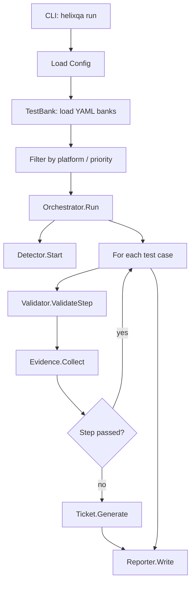

# HelixQA Architecture

**Module:** `digital.vasic.helixqa`

HelixQA is a cross-platform QA orchestration framework built on top of
`digital.vasic.challenges` and `digital.vasic.containers`. It provides real-time
crash detection, step-by-step validation, evidence collection, and automated ticket
generation for Android, Web, and Desktop targets.

---

## Package Overview

| Package | Role |
|---------|------|
| `pkg/config` | Configuration types and validation |
| `pkg/testbank` | YAML test bank loading with platform/priority filtering |
| `pkg/detector` | Platform-specific crash/ANR detection |
| `pkg/validator` | Step-by-step validation with per-step evidence |
| `pkg/evidence` | Centralized screenshot, video, log, and trace collection |
| `pkg/ticket` | Markdown issue ticket generation for AI fix pipelines |
| `pkg/reporter` | Report generation (reuses `challenges/pkg/report`) |
| `pkg/orchestrator` | Main QA pipeline coordinator |
| `pkg/autonomous` | SessionCoordinator, PlatformWorker, PhaseManager |
| `pkg/navigator` | NavigationEngine with ADB, Playwright, X11 executors |
| `pkg/issuedetector` | LLM-powered visual/UX/accessibility/functional bug detection |
| `pkg/llm` | LLM provider abstraction, adaptive fallback, cost tracking |
| `pkg/session` | SessionRecorder, Timeline, VideoManager |

---

## Orchestrator Flow



1. **Config** — `pkg/config` validates platform selection, speed mode (Slow/Normal/Fast),
   and report format from CLI flags and `.env`.
2. **TestBank** — `pkg/testbank` loads one or more YAML bank files, filters test cases
   by `--platform` and `--priority`, and returns an ordered execution list.
3. **Detector** — Starts in the background before test execution. Platform implementations:
   - `detector/android.go` — ADB `logcat` tail for FATAL/ANR lines + `pidof` liveness.
   - `detector/web.go` — `pgrep` on browser process name; JS console error injection.
   - `detector/desktop.go` — JVM/native `pgrep`; `kill -0` liveness probe.
   All detectors expose a `CommandRunner` interface so they are testable without
   a real device.
4. **Validator** — Executes each `Step` sequentially, calling `Evidence.Collect` before
   and after the action to produce a before/after screenshot pair.
5. **Ticket** — On step failure, `pkg/ticket` renders a Markdown issue ticket embedding
   the failing step, expected vs. actual output, stack trace, and evidence paths. Tickets
   are structured for consumption by AI fix pipelines.
6. **Reporter** — Delegates to `challenges/pkg/report` for Markdown/HTML/JSON output,
   augmenting the standard challenge report with QA-specific fields (crash log, video
   timestamp, ticket list).

---

## Detector Pipeline

```
Detector.Start()
  └─ goroutine: poll / tail platform log source
       └─ on match: CrashEvent{Platform, Message, Timestamp, StackTrace}
            └─ EventCh <-CrashEvent (buffered channel)

Orchestrator reads EventCh
  └─ attaches crash to current test case
  └─ marks step FAILED, triggers ticket generation
```

---

## Evidence Collection

`pkg/evidence.Collector` is the single write point for all artefacts:

| Evidence type | Source |
|---------------|--------|
| Screenshot | ADB `screencap`, Playwright `screenshot()`, X11 `scrot` |
| Video | ffmpeg screen capture started at session begin |
| Logcat / Console log | Buffered tail from detector |
| Stack trace | Extracted from crash event |

All artefacts are written under a per-session directory and referenced by relative
path in tickets and reports.

---

## Ticket Generation

`pkg/ticket.Generator` renders Markdown tickets with sections:

- **Summary** — one-line description from the failing step name.
- **Steps to Reproduce** — ordered list from the test case definition.
- **Expected / Actual** — from the step `expected` field vs. detected state.
- **Evidence** — embedded screenshot links and video timestamp.
- **Environment** — platform, device/browser, app version.

Tickets are self-contained so they can be filed directly into issue trackers or fed
to LLM-based auto-fix agents.

---

## Autonomous Session Architecture

The `autonomous` subcommand extends the standard pipeline with four phases:

1. **Setup** — LLMsVerifier selects LLMs; DocProcessor builds a FeatureMap;
   LLMOrchestrator spawns CLI agents; VisionEngine initialises screen analyser.
2. **Doc-Driven Verification** — `PlatformWorker` iterates every `Feature` in the
   FeatureMap, navigating to the relevant screen via `NavigationEngine` and capturing
   evidence at each step.
3. **Curiosity-Driven Exploration** — Workers explore screens not covered by docs,
   submitting edge-case inputs and rapid interactions; `IssueDetector` flags anomalies.
4. **Report & Cleanup** — `SessionCoordinator` aggregates coverage metrics, ticket
   list, and navigation map; `Reporter` writes the final QA report.

`PhaseManager` enforces phase transitions and propagates context cancellation so a
`--timeout` flag cleanly terminates all workers.

---

## Phase-Specific Model Selection

HelixQA's autonomous pipeline selects different LLM models for each phase using
dedicated LLMsVerifier strategies. This ensures each phase gets the model best
suited to its task rather than using a one-size-fits-all approach.

### Strategy Mapping

| Phase | LLMsVerifier Strategy | Model Type | Key Dimensions |
|-------|----------------------|-----------|----------------|
| Learn | `PlanningStrategy` | Chat | Reasoning (35%), Context (25%), Structured output (20%) |
| Plan | `PlanningStrategy` | Chat | Reasoning (35%), Context (25%), Structured output (20%) |
| Execute | `NavigationStrategy` | Vision | JSON compliance (40%), GUI understanding (25%), Speed (20%) |
| Curiosity | `NavigationStrategy` | Vision | JSON compliance (40%), GUI understanding (25%), Speed (20%) |
| Analyze | `AnalysisStrategy` | Vision | Description quality (35%), OCR (20%), Object detection (20%) |

### Why Phase-Specific Selection Matters

- **Execute/Curiosity** need models that produce valid JSON action arrays (e.g., Gemini Flash).
  Models like Astica that return natural-language descriptions are unsuitable and score 0.2 on
  the JSON compliance dimension.
- **Analyze** needs models with rich image description, OCR, and object detection (e.g., Astica).
  Speed is less critical since analysis runs once on selected screenshots.
- **Learn/Plan** need models with strong reasoning and large context windows (e.g., Claude,
  Gemini Pro). Vision capability is not required.

### Bridged CLI Models

Models available via CLI coding assistants (Claude Code, Qwen Coder, OpenCode) are
discovered by `LLMsVerifier/pkg/bridge/` and included in the scoring pool alongside cloud
and local providers. They have zero token cost (the CLI handles billing) and are tagged with
a "bridged" capability. Only Claude Code currently supports vision input.

### Model Selection Flow

```
PhaseModelSelector
  ├── Learn/Plan phase
  │     └── PlanningStrategy.Rank(allModels)
  │           └── PlanningStrategy.Select(ranked, requirements)
  │                 └── Best chat model (Claude, Gemini, GPT)
  ├── Execute/Curiosity phase
  │     └── NavigationStrategy.Rank(allModels)
  │           └── NavigationStrategy.Select(ranked, {NeedsVision: true})
  │                 └── Best JSON-capable vision model (Gemini Flash)
  └── Analyze phase
        └── AnalysisStrategy.Rank(allModels)
              └── AnalysisStrategy.Select(ranked, {NeedsVision: true})
                    └── Best analysis vision model (Astica, GPT-4o)
```

---

## LLM Cost Tracking

Every autonomous session automatically tracks the USD cost of all LLM API calls
via `CostTracker` (`pkg/llm/cost_tracker.go`).

### Data Flow

```
NewSessionPipeline()
  └── NewCostTracker() ← pre-populated with provider rates
       ├── attached to default AdaptiveProvider
       ├── attached to chatProvider (if set)
       └── attached to visionProvider (if set)

AdaptiveProvider.Chat() / .Vision()
  └── on success → recordCost(provider, resp, callType, true)
       └── CostTracker.Record(provider, model, phase, callType, tokens, success)

Pipeline.Run() finalization
  └── costTracker.Summary() → PipelineResult.Cost
       └── serialized into pipeline-report.json
```

### Key Types

- `CostRecord` — single API call: provider, model, phase, tokens, cost, success
- `CostRate` — per-1K-token rates (input + output) for a provider
- `CostSummary` — aggregate: total cost, calls, tokens, breakdowns by provider/phase/call-type
- `ProviderCost` — per-provider aggregate with call count and token totals

### Thread Safety

`CostTracker` uses `sync.RWMutex` for all reads/writes. Multiple platform workers
can record costs concurrently without races. The race detector validates this in
`TestCostTracker_ConcurrentAccess`.
