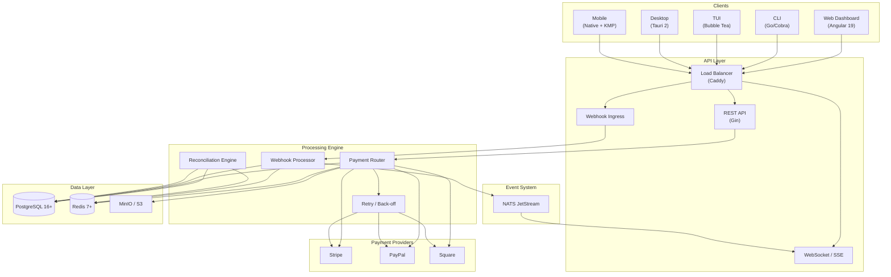
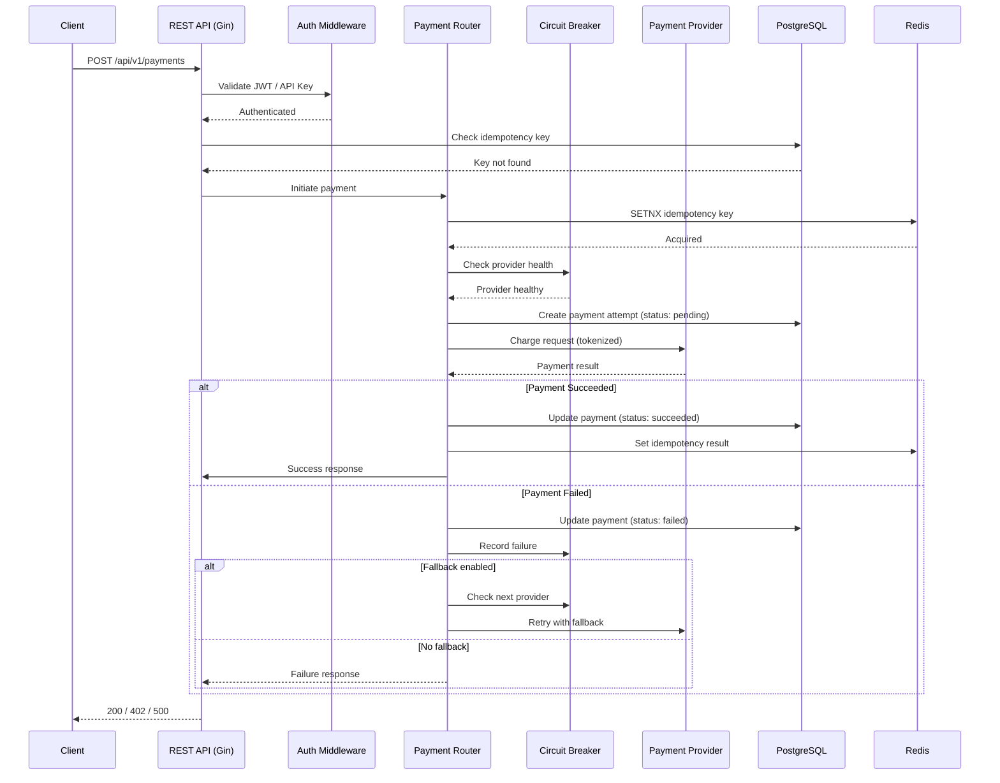
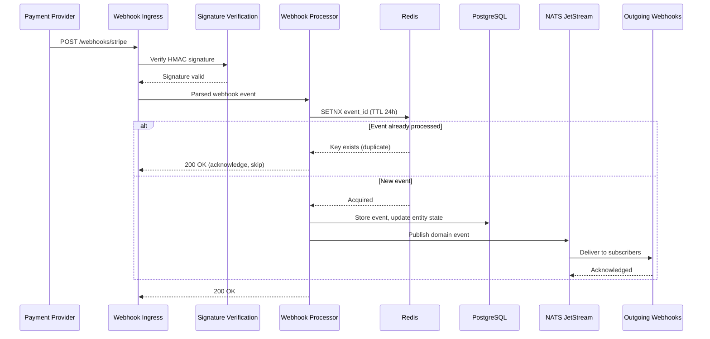
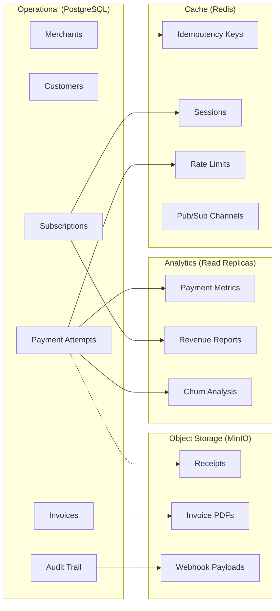
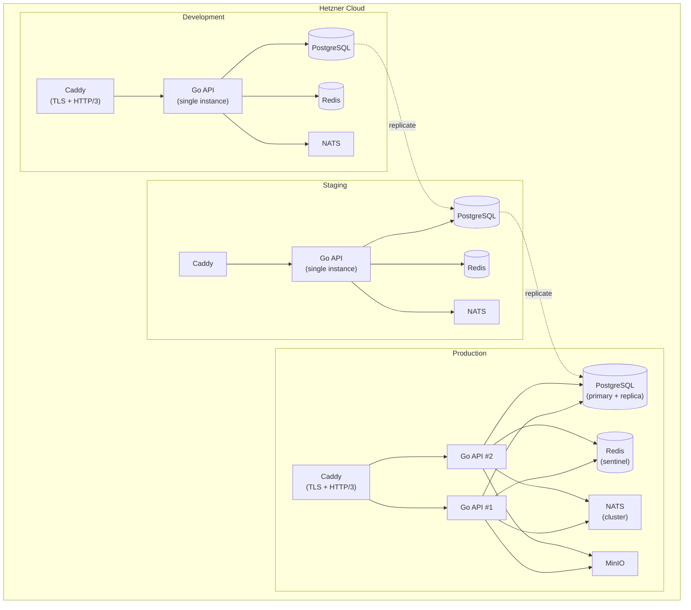

# Helix Seller — Architecture Documentation

## System Overview

Helix Seller is a **payment facade** — a unified abstraction layer over multiple payment providers (Stripe, PayPal, Square). It provides a single REST API that merchant applications integrate against, while internally routing payment operations to the appropriate provider with automatic fallback, idempotent processing, and full event-driven lifecycle management.

The system is **merchant-managed**: the operator (merchant) retains control over provider configuration, routing rules, and reconciliation. It is **PCI DSS-aware**: raw card data never enters the system — all sensitive payment data is tokenized at the provider level. It supports **multi-currency** operations and handles provider-specific quirks (tax calculation, invoicing, subscription state machines) behind a uniform interface.

**Key Design Principles:**

- **Provider-agnostic API** — integrate once, switch providers without code changes
- **Automatic provider fallback** — if the primary provider fails, traffic routes to the next available provider
- **Idempotent operations** — duplicate webhook deliveries and API retries never create duplicate state
- **Event-driven lifecycle** — all state transitions emit events for downstream consumers
- **Zero raw card data** — tokenization-only, PCI DSS scope minimized

---

## Core Components

### Data Layer

| Component | Technology | Responsibility |
|-----------|-----------|----------------|
| Relational Store | PostgreSQL 16+ | Merchants, customers, subscriptions, invoices, audit trail, payment attempts |
| Cache / Idempotency | Redis 7+ | Idempotency keys, session tokens, rate limiting, real-time pub/sub, temporary locks |
| Object Storage | MinIO / S3-compatible | Receipts, invoices (PDF), uploaded files, webhook payloads for replay |

### Processing Engine

| Component | Description |
|-----------|-------------|
| **Payment Router** | Selects the target provider based on merchant config, currency, geography, and availability. Applies circuit-breaker state and fallback rules. |
| **Webhook Processor** | Receives, verifies (HMAC signatures), deduplicates (event ID + Redis SETNX), and dispatches incoming webhook events from providers. |
| **Reconciliation Engine** | Periodically compares internal state with provider state. Detects discrepancies (missed webhooks, failed state syncs) and triggers corrective actions. |
| **Retry / Back-off Engine** | Handles transient failures with exponential backoff, jitter, and configurable retry budgets. Applies to outbound API calls and event delivery. |

### Event System

| Component | Technology | Description |
|-----------|-----------|-------------|
| Event Bus | NATS JetStream | Durable, ordered, at-least-once event delivery for internal service communication and outgoing webhook dispatch to merchant applications. |

Events are published on every significant state change: payment initiated, payment succeeded, payment failed, subscription created, subscription updated, subscription cancelled, invoice generated, refund processed.

### API Layer

| Interface | Description |
|-----------|-------------|
| **REST API** | Primary interface. OpenAPI-documented. JWT RS256 authentication for merchants, API key authentication for programmatic access. |
| **Webhook Ingress** | Dedicated endpoints for receiving provider webhooks (`/webhooks/stripe`, `/webhooks/paypal`, `/webhooks/square`). Signature-verified, idempotent processing. |
| **WebSocket / SSE** | Real-time push for payment status updates, subscription lifecycle events, and system notifications to connected clients. |

### Client Applications

| Client | Technology | Description |
|--------|-----------|-------------|
| Web Dashboard | Angular 19 | Merchant-facing admin UI for configuration, monitoring, and reporting |
| CLI | Go / Cobra | Command-line interface for scripting, automation, and developer workflows |
| TUI | Bubble Tea | Terminal user interface for interactive operations and status monitoring |
| Desktop | Tauri 2 | Native desktop application wrapping the web dashboard |
| Mobile | Native + Kotlin Multiplatform | iOS (Swift) and Android (Kotlin) with shared business logic via KMP |

---

## Architecture Diagrams

### High-Level System Architecture



### Request Flow: API → Router → Provider → Response



### Event Flow: Webhook → Processor → Event Bus → Outgoing



### Data Flow: Relational ↔ Analytics



### Deployment Architecture



---

## Design Patterns

### Adapter Pattern (Payment Providers)

Each payment provider (Stripe, PayPal, Square) is wrapped behind a common `PaymentProvider` interface. The adapter translates between the unified Helix domain model and the provider-specific API, handling differences in request/response formats, authentication mechanisms, and error semantics.

```go
type PaymentProvider interface {
    Charge(ctx context.Context, req ChargeRequest) (*ChargeResponse, error)
    Refund(ctx context.Context, req RefundRequest) (*RefundResponse, error)
    CreateSubscription(ctx context.Context, req SubscriptionRequest) (*SubscriptionResponse, error)
    CancelSubscription(ctx context.Context, id string) error
    VerifyWebhookSignature(payload []byte, signature string) (bool, error)
    ParseWebhookEvent(payload []byte) (*WebhookEvent, error)
}
```

### Circuit Breaker (Provider Fallback)

Each provider adapter is fronted by a circuit breaker that tracks failure rates. When a provider exceeds a configurable failure threshold, the circuit opens and traffic is routed to the next available provider. The circuit half-opens after a cooldown period to probe recovery.

**States:** Closed (healthy) → Open (unhealthy) → Half-Open (probing)

### Idempotency (Payment Operations)

All state-mutating operations accept an optional `Idempotency-Key` header. The key is stored in Redis with a TTL. Subsequent requests with the same key return the cached result without re-executing the operation. Webhook events are deduplicated by provider event ID using Redis `SETNX`.

### Event-Driven Architecture (NATS JetStream)

Every significant state transition publishes a domain event to NATS JetStream. Events are durable (persisted to disk), ordered within a stream, and delivered at-least-once to consumers. This decouples internal services and enables reliable outgoing webhook dispatch.

### Repository Pattern (Data Access)

All database access goes through repository interfaces. This separates data access logic from business logic, enables testing with mock repositories, and allows future migration to different storage backends without changing service code.

### Middleware Chain (Cross-Cutting Concerns)

Gin middleware handles authentication, authorization, rate limiting, request logging, correlation ID injection, and error recovery. Each concern is a standalone middleware function composed into the chain.

---

## Security Architecture

### Authentication

| Mechanism | Scope | Details |
|-----------|-------|---------|
| **JWT RS256** | Merchant dashboard, API consumers | Asymmetric key pair. Access tokens expire in 15 minutes. Refresh tokens rotate on use. |
| **API Keys** | Programmatic / server-to-server access | Scoped keys with explicit permission boundaries (read-only, write, admin). Revocable. |
| **TOTP MFA** | Admin-tier accounts | Time-based one-time password for high-privilege operations (provider key rotation, account deletion). |

### Encryption

| Layer | Mechanism | Details |
|-------|-----------|---------|
| **In Transit** | TLS 1.3 | All external traffic encrypted. HTTP/3 (QUIC) provides built-in encryption. |
| **At Rest** | AES-256-GCM | Database fields containing sensitive data (API keys, tokens) encrypted at the application level. |
| **Tokenization** | Provider-level | Raw card data never enters the system. Providers return tokens for subsequent operations. |

### PCI DSS Awareness

Helix Seller operates at **PCI DSS SAQ-A** scope by design:

- No raw card data is stored, processed, or transmitted by the application
- All card handling is delegated to PCI-compliant providers via tokenization
- Webhook payloads are verified by HMAC signature before processing
- Audit trail logs all state transitions with actor, timestamp, and diff

---

## Technology Stack

| Component | Technology | Version | Purpose | Provenance |
|-----------|-----------|---------|---------|------------|
| Language | Go | 1.22+ | Primary application language | [go.dev](https://go.dev/) |
| Web Framework | Gin Gonic | v1.9+ | HTTP routing, middleware, validation | [gin-gonic.com](https://gin-gonic.com/) |
| JWT Library | golang-jwt | v5.2+ | JWT RS256 token generation and verification | [github.com/golang-jwt](https://github.com/golang-jwt/jwt) |
| Database Driver | pgx | v5.6+ | PostgreSQL connection pool and query execution | [github.com/jackc/pgx](https://github.com/jackc/pgx) |
| Database | PostgreSQL | 16+ | Persistent relational storage, audit trail, full-text search | [postgresql.org](https://www.postgresql.org/) |
| Cache / KV | go-redis | v9.5+ | Redis client for caching, idempotency, rate limiting | [github.com/redis/go-redis](https://github.com/redis/go-redis) |
| Cache | Redis | 7+ | In-memory store for ephemeral and hot data | [redis.io](https://redis.io/) |
| Event Bus | NATS Go Client | v1.35+ | NATS JetStream client for durable event delivery | [github.com/nats-io/nats.go](https://github.com/nats-io/nats.go) |
| Event Bus Server | NATS JetStream | — | Durable, ordered, at-least-once message delivery | [nats.io](https://nats.io/) |
| Object Storage | MinIO | — | S3-compatible file and receipt storage | [min.io](https://min.io/) |
| Reverse Proxy | Caddy | — | Automatic TLS, HTTP/3 (QUIC), Brotli compression | [caddyserver.com](https://caddyserver.com/) |
| Logging | Zap | v1.27+ | High-performance structured logging | [go.uber.org/zap](https://go.uber.org/zap) |
| Configuration | godotenv | v1.5+ | Environment variable loading from `.env` files | [github.com/joho/godotenv](https://github.com/joho/godotenv) |
| UUID Generation | google/uuid | v1.6+ | UUID v4 generation for entity identifiers | [github.com/google/uuid](https://github.com/google/uuid) |
| Testing | testify | v1.9+ | Test assertions, suites, and mocking | [github.com/stretchr/testify](https://github.com/stretchr/testify) |
| Container Runtime | Podman | 5+ | Rootless container orchestration for services | [podman.io](https://podman.io/) |
| Web Dashboard | Angular | 19 | Merchant-facing admin interface | [angular.dev](https://angular.dev/) |
| CLI Framework | Cobra | — | Command-line interface construction | [github.com/spf13/cobra](https://github.com/spf13/cobra) |
| TUI Framework | Bubble Tea | — | Terminal user interface construction | [github.com/charmbracelet/bubbletea](https://github.com/charmbracelet/bubbletea) |
| Desktop Framework | Tauri | 2.x | Native desktop application shell | [tauri.app](https://tauri.app/) |
| Mobile | Kotlin Multiplatform | — | Shared business logic for iOS/Android | [kotlinlang.org/docs/multiplatform.html](https://kotlinlang.org/docs/multiplatform.html) |
