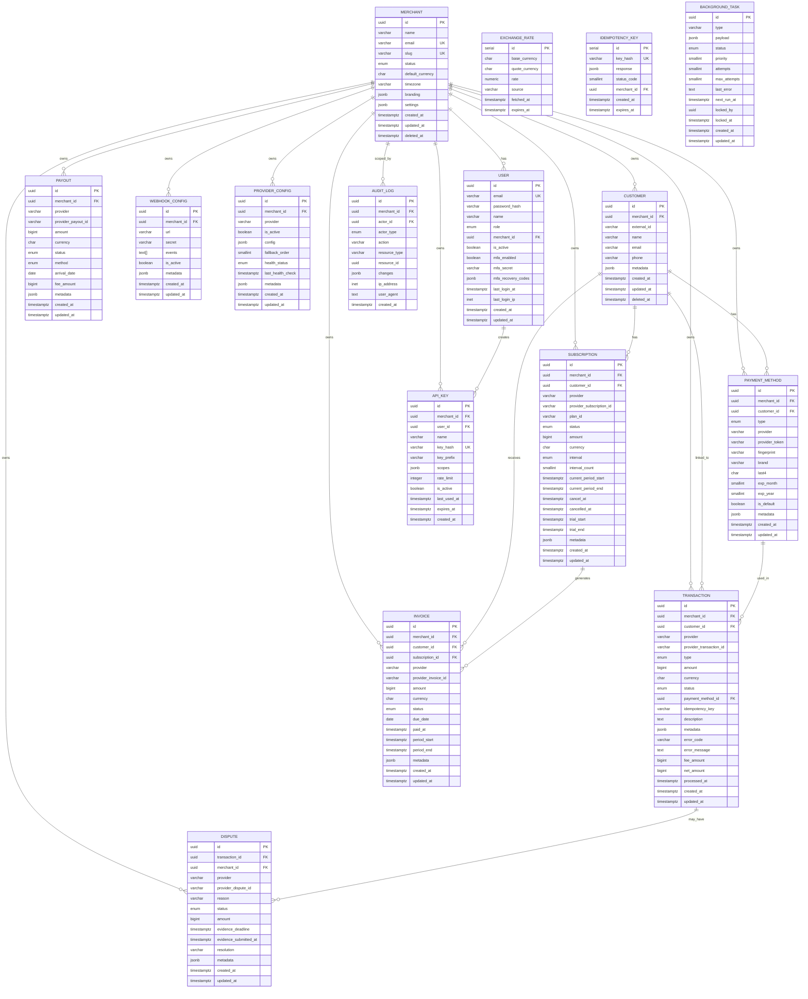

# Database Overview

## Database Engine

| Environment | Engine | Version |
|-------------|--------|---------|
| Production  | PostgreSQL | 16+ |
| Development | SQLite | 3.x |

PostgreSQL is the primary data store. SQLite is used for local development and testing only; features such as partitioning, JSONB operators, and `INET` types are emulated or skipped in SQLite.

## Schema Summary

16 entities organized into five functional groups:

| Group | Entities |
|-------|----------|
| **Tenant & Users** | Merchant, Customer, User, ApiKey |
| **Payments** | PaymentMethod, Transaction, Subscription, Invoice, Payout, Dispute |
| **Configuration** | WebhookConfig, ProviderConfig |
| **Infrastructure** | AuditLog, ExchangeRate, IdempotencyKey, BackgroundTask |

## Global Conventions

| Convention | Detail |
|------------|--------|
| Primary keys | `UUID` v7 (time-ordered) unless noted otherwise |
| Timestamps | `TIMESTAMP WITH TIME ZONE` (`TIMESTAMPTZ`) for all timestamp columns |
| Metadata | `JSONB DEFAULT '{}'` for arbitrary key-value extensions |
| Soft delete | `deleted_at TIMESTAMPTZ NULL` on Merchant and Customer; rows with non-NULL `deleted_at` are excluded by default queries |
| Partitioning | Monthly range partition on `created_at` for Transaction and AuditLog |
| Amounts | `BIGINT` storing smallest currency unit (e.g., cents) |
| Currencies | `CHAR(3)` ISO 4217 codes |
| Enums | PostgreSQL `ENUM` types for bounded value sets |

## Entity Relationship Diagram



## Indexing Strategy

All indexes are B-tree unless otherwise noted.

| Principle | Detail |
|-----------|--------|
| Tenant isolation | Every query-scoped table has a `merchant_id` index as the leading column |
| Unique constraints | `slug`, `email`, `key_hash`, `idempotency_key`, `provider_transaction_id`, `provider_subscription_id` are unique |
| Composite indexes | `provider_configs(merchant_id, provider)`, `audit_logs(resource_type, resource_id)` |
| Status filtering | Index on `status` columns for Transaction, Subscription, Invoice, Payout, Dispute |
| Time-range queries | Index on `created_at` and `processed_at` for partitioned tables |
| Background tasks | Composite index `(status, next_run_at)` for efficient worker claiming |
| Idempotency cleanup | Index on `expires_at` for TTL-based garbage collection |

Full index definitions per entity are in [schema.md](schema.md).

## Partitioning Strategy

Two tables use monthly range partitioning on `created_at`:

| Table | Partition Key | Rationale |
|-------|--------------|-----------|
| Transaction | `created_at` | High write volume; time-range queries dominate |
| AuditLog | `created_at` | Append-only; time-range queries for compliance |

- Partitions are created monthly via a scheduled job (e.g., `pg_partman`).
- Old partitions can be detached and archived per retention policy.
- Foreign key constraints are deferred to the partition key to avoid cross-partition FK issues.

## Soft Delete Pattern

Applied to **Merchant** and **Customer** only.

```sql
-- Query pattern: exclude soft-deleted rows
SELECT * FROM merchants WHERE deleted_at IS NULL;

-- Restore a soft-deleted entity
UPDATE merchants SET deleted_at = NULL WHERE id = $1;
```

Cascade behavior: when a Merchant is soft-deleted, associated entities are not cascade-deleted but are excluded from active queries via `merchant_id` joins filtered through the merchant's `deleted_at`.

## JSONB Usage

| Table | Column | Content |
|-------|--------|---------|
| Merchant | `branding` | `{ logo_url, colors: { primary, accent }, slogan }` |
| Merchant | `settings` | Merchant-specific configuration knobs |
| Customer | `metadata` | Arbitrary key-value pairs from the merchant |
| PaymentMethod | `metadata` | Custom data attached to the payment instrument |
| Transaction | `metadata` | Custom data attached to the transaction |
| Subscription | `metadata` | Custom data attached to the subscription |
| Invoice | `metadata` | Custom data attached to the invoice |
| Payout | `metadata` | Custom data attached to the payout |
| Dispute | `metadata` | Custom data attached to the dispute |
| WebhookConfig | `metadata` | Custom data |
| ProviderConfig | `config` | Encrypted API keys and webhook secrets |
| ProviderConfig | `metadata` | Custom data |
| User | `mfa_recovery_codes` | Hashed recovery codes array |
| ApiKey | `scopes` | Array of allowed operation scopes |
| AuditLog | `changes` | `{ before: {...}, after: {...} }` diff object |
| IdempotencyKey | `response` | Cached response body |
| BackgroundTask | `payload` | Task-specific data |

## Data Retention

| Data | Retention | Mechanism |
|------|-----------|-----------|
| IdempotencyKey | 24-48 hours | Background job deletes expired rows hourly |
| AuditLog | Indefinite (configurable) | Merchant-level retention setting; partition detach for archival |
| Transaction | Indefinite | System of record; never hard-deleted |
| BackgroundTask completed | 7 days | Background job purges completed/dead tasks |
| ExchangeRate | 7 days | Background job purges expired rates |

## Security Considerations

- **Payment tokens**: `provider_token` stores provider-issued tokens, never raw card data. PCI DSS scope is minimized.
- **API keys**: Only `key_hash` (SHA-256) and `key_prefix` are stored. Full key is shown once at creation.
- **Provider credentials**: `ProviderConfig.config` is encrypted at rest; decryption happens only in the provider adapter layer.
- **MFA secrets**: `User.mfa_secret` is encrypted; recovery codes are hashed.
- **Row-level security**: Enforced via `merchant_id` checks in the application layer (RLS policies in PostgreSQL are optional).
