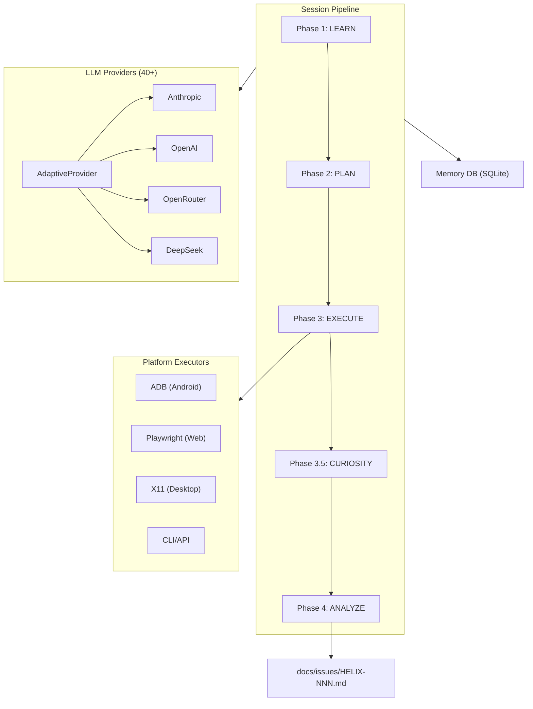

# Architecture

## System Overview

HelixQA is a multi-phase autonomous QA pipeline backed by adaptive LLM providers and persistent memory.

## Package Map

| Layer | Packages |
|-------|----------|
| **Core** | `pkg/llm/` (40+ providers), `pkg/memory/` (SQLite), `pkg/config/` |
| **Intelligence** | `pkg/learning/` (ingestion), `pkg/planning/` (test gen), `pkg/analysis/` (vision) |
| **Execution** | `pkg/navigator/` (5 executors), `pkg/detector/` (crash), `pkg/performance/` (metrics), `pkg/video/` (recording) |
| **Orchestration** | `pkg/autonomous/` (pipeline), `pkg/orchestrator/`, `pkg/session/` |
| **Output** | `pkg/reporter/` (reports), `pkg/ticket/` (issues), `pkg/validator/` |

## Phase Details

### Phase 1: Learn
Reads CLAUDE.md, docs/, codebase structure (Gin routes, React routes, Compose navigation), git history, and prior QA sessions from memory DB.

### Phase 2: Plan
LLM generates test cases from KnowledgeBase. Reconciles with existing YAML test banks. Ranks by priority (critical first, prior failures boosted).

### Phase 3: Execute
Creates platform executors, starts video recording, runs each test with screenshots, crash/ANR detection, and performance metrics collection.

### Phase 3.5: Curiosity
Random DPAD/click navigation to discover untested screens. Captures additional screenshots for analysis.

### Phase 4: Analyze
LLM vision analyzes every screenshot for visual defects, UX issues, accessibility problems. Detects memory leaks from metrics. Creates issue tickets via FindingsBridge.

## Memory Schema

7 SQLite tables: `sessions`, `test_results`, `findings`, `screenshots`, `metrics`, `knowledge`, `coverage`.
